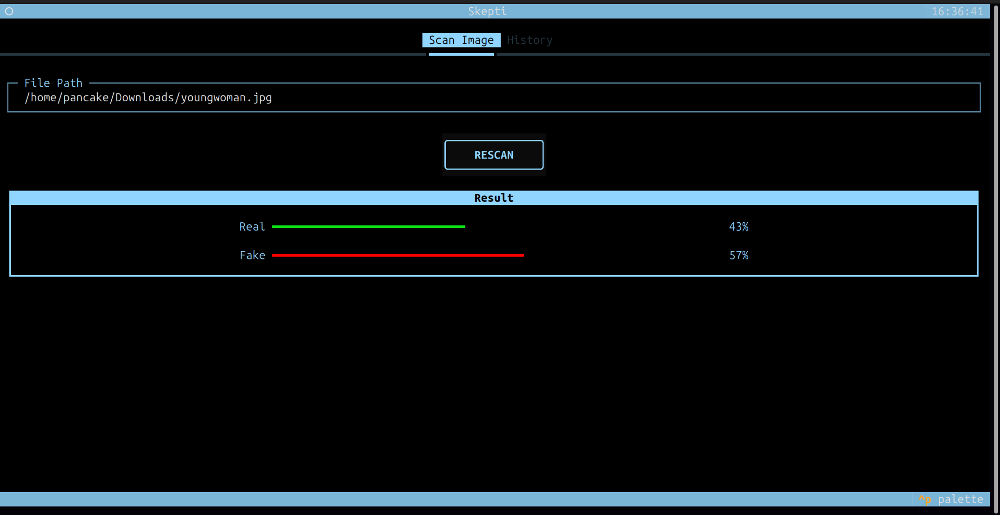
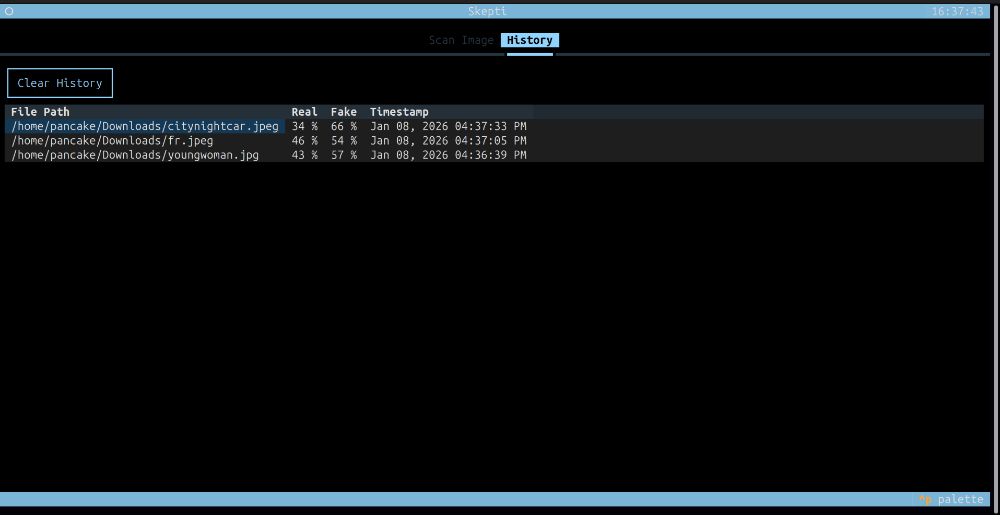

<h1 align="center">Skepti</h1>

<p align="center">A terminal-based local system to detect DeepFake images</p>

<div align="center">

[](https://hackday.pages.dev/hackday)
[]()
[](https://github.com/Atia-Farha/Skepti/issues)
[](https://github.com/Atia-Farha/Skepti/pulls)

</div>

---

A terminal-based DeepFake image detection system designed to run locally on a user’s machine without requiring an
internet connection. It enables users to analyze images and determine whether an image is real or AI-generated (
DeepFake), ensuring privacy-focused predictions.

## Table of Contents

- [Problem Statement](#problem-statement)
- [Idea / Solution](#idea--solution)
- [Dependencies](#dependencies)
- [Limitations](#limitations)
- [Future Scope](#future-scope)
- [Key Features](#key-features)
- [Getting Started](#getting-started)
    - [Prerequisites](#prerequisites)
    - [Setup before 1st Run](#setup-before-1st-run)
    - [Setup before Every Run](#setup-before-every-run)
    - [Run the Application](#run-the-application)
- [How to use](#how-to-use)
- [Built With](#built-with)
- [Authors](#authors)

## Problem Statement
**Theme-w5:** Could a feeling hide inside a visual pattern, waiting for someone to understand it ?


## Idea / Solution

- IDEAL

In an ideal scenario, users should be able to verify the authenticity of an image quickly and intuitively, without relying on technical expertise. Visual media should remain a trustworthy source of information, where the likelihood of an image being real or AI-generated can be clearly communicated through an accessible and interpretable system. A reliable deepfake detection mechanism would reduce confusion, restore trust in digital content, and help users make informed decisions in an AI-driven world.

- REALITY

With the rapid advancement of generative AI, deepfake images have become increasingly common and visually convincing. Distinguishing between real and AI-generated images is difficult for the average user, leading to uncertainty and mistrust. Existing solutions are either opaque, inconsistent, or inaccessible. While pretrained ML models can provide stable predictions, more flexible approaches such as custom-trained models require significant data and tuning, which are often out of scope in early-stage implementations.

- CONSEQUENCES

If this problem remains unaddressed, misinformation, manipulation, and erosion of trust in visual content will continue to grow. Individuals and organizations may make incorrect decisions based on falsified images, leading to social, reputational, and economic harm. The inability to reliably assess image authenticity ultimately weakens confidence in digital communication and amplifies the risks associated with rapid AI-generated content adoption.

## Dependencies

* **Pretrained Models (TorchVision):** The system depends on publicly available pretrained models to enable fast and reliable inference without custom training.
* **PyTorch Ecosystem:** Core functionality relies on PyTorch, TorchVision, and PIL for model execution and image preprocessing.
* **Compute Resources:** Performance is constrained by available CPU/GPU resources, influencing model size and inference speed.

## Limitations

* **No Custom Training:** The model uses pretrained weights due to time, data, and compute constraints, which may reduce accuracy on novel or unseen deepfake styles.
* **Face-Centric Bias:** Most deepfake datasets focus on facial manipulation, limiting reliability for non-face or abstract images.
* **Experimental Torch Backend:** The Torch-based implementation is non-deterministic and uncalibrated, as it is intended only as a future research scaffold.
* **Image-Only Support:** Video deepfake detection is not yet implemented due to added computational and temporal modeling complexity.
* **Confidence Calibration:** Output probabilities are not fully calibrated and should be interpreted as indicative rather than definitive.

## Future Scope

While Skepti successfully demonstrates image-based deepfake detection within the hackathon timeline, several planned capabilities could not be fully developed due to time, data, and computational constraints. Custom training and fine-tuning of models on domain-specific deepfake datasets were outside the scope of this iteration, limiting adaptability to newly emerging deepfake techniques. Video-based deepfake detection, which requires temporal and spatiotemporal modeling, was also deferred due to its added complexity and higher resource requirements.

In the future, Skepti can evolve into a more robust and adaptive system by incorporating custom-trained models, improved confidence calibration, and ensemble-based detection strategies. Extending support to video and multimodal inputs (image, audio, and metadata) would significantly enhance real-world applicability. Additionally, integrating explainability mechanisms and continuous model updates can help maintain reliability as generative AI techniques continue to advance.


## Key Features

- Terminal-based interface – Interactive, user-friendly, and visually appealing TUI
- Image file input support – Analyze local image files
- Fully local execution – No internet connection required once the system built (after the first setup)
- AI-powered detection – Analyzes image patterns to detect DeepFakes
- Visual result representation – Horizontal bar graph visualization of results
- Cross-platform compatibility – Works on Windows, macOS, and Linux

## Getting Started

Follow these instructions to set up and run the application on your local machine.

### Prerequisites

- Python -> [Installation Guide](/docs/PYTHON-INSTALLATION.md)
- Git (to clone the repository)

### Setup before 1st Run

1. Clone the repository
    ```bash
    git clone https://github.com/Atia-Farha/Skepti.git
    ```
2. Open a terminal and navigate to the project directory
    ```bash
    cd path/to/folder/Skepti
    ```
3. Set up a virtual environment (optional but recommended)
    ```bash
    python -m venv .venv
    ```
4. Activate the virtual environment
    - On Windows
        ```bash
        .venv\Scripts\activate
        ```
    - On macOS / Linux
        ```bash
        source .venv/bin/activate
        ```
5. Install the required dependencies
    ```bash
    pip install textual torch pillow torchvision
    ```

### Setup before Every Run

1. Navigate to the project directory
    ```bash
    cd path/to/folder/Skepti
    ```
2. Activate the virtual environment
    - On Windows
        ```bash
        .venv\Scripts\activate
        ```
    - On macOS / Linux
        ```bash
        source .venv/bin/activate
        ```

### Run the Application

**Windows**

```bash
python main.py
```

**macOS / Linux**

```bash
python3 main.py
```
> **Caution:** When running the application for first time , it may take a little time to download AI model.


## How to Use

- Enter the absolute path of the image file you want to detect.
- Press the "SCAN NOW" button to start the detection process.
- View the generated result with the horizontal bar graph visualization.
- Go to "History" tab to view past results 

## Preview




## Built With

- **Python** - Core Language
- **Textual** - TUI Framework
- **Torch** - Machine learning framework
- **Pillow** - Image Processing Library
- **Torchvision** - Machine learning framework extension
- **Sqlite** - Database

## Authors

- [**Atia Farha**](https://github.com/Atia-Farha) - Frontend Developer
- [**S.M Nazmus Sadat**](https://github.com/smsadat-dev) - Backend Developer